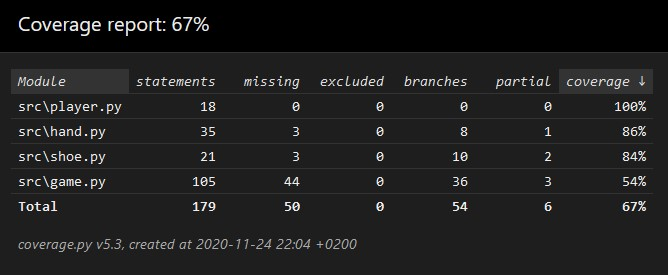

# Testausdokumentti

Ohjelmaa on testattu sekä automatisoiduin yksikkö- ja integraatiotestein unittestilla sekä manuaalisesti tapahtunein järjestelmätason testein.

## Testikattavuus

Testauksia on laajennettu koskemaan jokaista luokkaa ja testauksen haarautumakattavuus on tällä hetkellä `67%`.

Testauksia laajennetaan seuraavaan versioon, sillä tavoitteena on lähes 100% haarautumakattavuus.

## Pylint

Pylintillä suoritettujen testien arvosana on tällä hetkellä `10.00/10`. Koodia on muokattu Pylintin antamien ilmoitusten mukaisesti ja jokaiselle luokalle, metodille sekä funktiolle on lisätty sen toimintaa selittävä docstring.

## Järjestelmätestaus

Sovelluksen järjestelmätestausta on suoritettu manuaalisesti.

### Asennus ja konfigurointi

Sovellus on haettu ja sen asennusta on testattu [käyttöohjeen](kayttoohje.md) mukaisesti Windows-ympäristössä. Tulevaisuudessa nämä testit laajennetaan myös Linux-ympäristöön.

## Laatuongelmat

Sovellus on tällä hetkellä ensimmäisessä versiossaan, eikä se edusta lopullista tuotetta, sillä muun muassa puuttuvia toiminnallisuuksia on vielä lukuisia.

