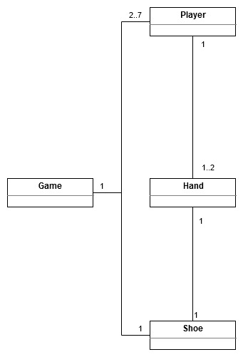

## Blackjack pelin arkkitehtuurikuvaus

Ohessa luokkakaavion muodossa esitys Blackjack pelin alustavasta rakenteesta. Tätä dokumenttia täydennetään projektin edetessä.

### Päätoiminnallisuudet

Blackjackissa toiminnallisuuksia on lukuisia ja tässä alla niistä yksi.

#### Kortin siirtyminen kengästä pelaajan käteen

Oheisessa sekvenssikaaviossa kuvataan, miten pelaaja käynnistää uuden kierroksen ja käskee jakajaa jakamaan hänelle kengästä (shoe) uuden kortin. Sitten pelaajan yhteispisteet tarkistetaan ja ne ovat tällä kertaa alle 21.

