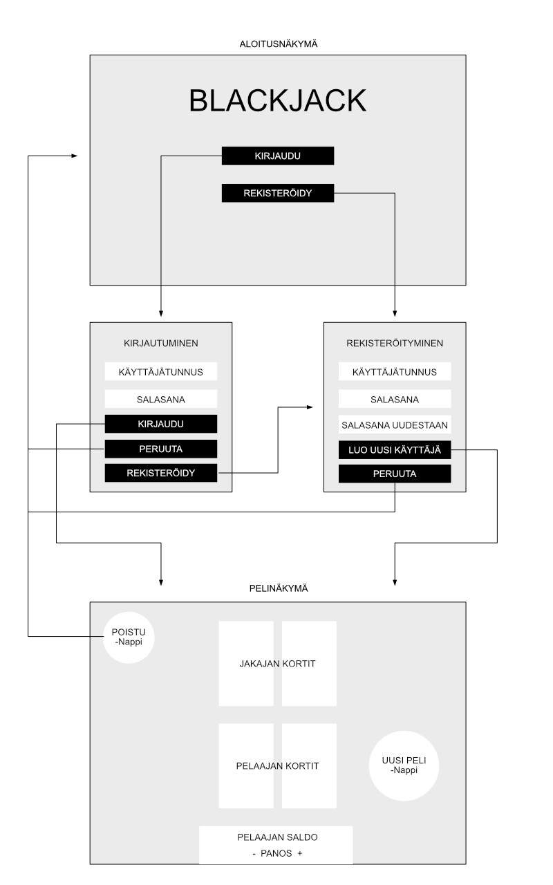

# Blackjack-korttipeli
## Sovelluksen tarkoitus
Blackjack-korttipeli on tarkoitettu kaikille kortti- ja uhkapeleistä kiinnostuneille. Siinä on mahdollista joko voittaa moninkertaisesti tai hävitä panostamansa summa talon jakajaa vastaan.
## Käyttäjät
Alkuvaiheessa pelaajia voi olla vain yksi talon jakajaa vastaan. Moninpelin mahdollisuutta mietitään ajan asettamien rajoitusten puitteessa.
## Käyttöliittymä
Ensimmäinen hahmotelma käyttöliittymästä

## Perusversion toiminnallisuudet
- Mahdollisuus pelata Blackjack korttipeliä (muutamaa toiminnallisuutta lukuun ottamatta valmis).
- Jakaja toimii Blackjackin sääntöjen mukaisesti (tehty).
- Kun pelaajan tai jakajan käteen tulee ässä, sillä on dynaaminen vaikutus käden pisteisiin (tehty).
- Kun luodaan uusi shoe, se katkaistaan cut card:lla, joka asetetaan shoen viimeisten 60-75 kortin väliin. (tehty).
- Panoksen kasvattaminen ja pienentäminen. (100-500 €) (tehty) .
- Käden jakaminen, eli "split"  (ei valmis).
- Panoksen tuplaus (ei valmis).
- Käyttäjän rekisteröinti ja kirjautuminen (ei valmis).
- Graafinen käyttöliittymä "GUI" (ei valmis).
## Jatkokehitysideat
Ensimmäisen version jälkeen ohjelmistoa voi laajentaa esimerkiksi:
- Moninpelillä muutaman kaverin kanssa.
- Suurempaan moninpeliin soveltuvalla "aullalla".
- Käyttäjät näkevät pelissä oleviin pöytiin, vaikka eivät itse osallistu peliin.
